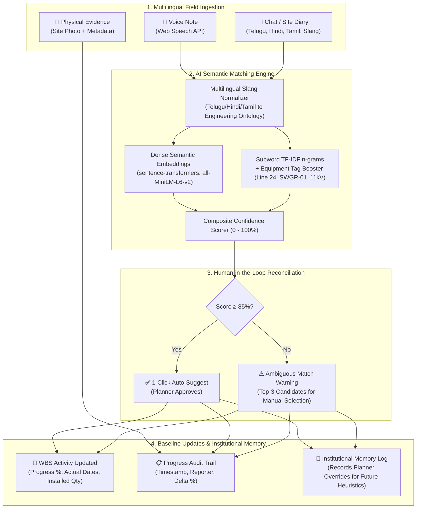

# 🏗️ SIH26122: AI-Powered Construction Progress Reconciliation System

> **Reconciling Informal, Multilingual Field Observations (Voice/Text) to Primavera & MS Project WBS L5/L6 Baseline Schedules with Human-in-the-Loop Verification.**

---

## 📌 Executive Summary & The Problem

On infrastructure and industrial EPC projects (refineries, power plants, transit lines, substations), formal schedules are maintained by planning engineers in tools like **Primavera P6** and **MS Project** down to **Level 5 & Level 6 Work Breakdown Structure (WBS)** activities.

However, daily site reality arrives in fragmented, unstructured formats:
* 🎤 Multilingual voice notes on walkie-talkies or mobile devices in regional Indian languages (*Telugu, Hindi, Tamil, Hinglish*).
* 📱 WhatsApp site diaries with informal slang (*"24 inch spool erection aipoyindi"*, *"turbine pedestal concreting 80% ho gaya"*, *"mud poured on transformer pad"*).
* ⚠️ Inconsistent terminology where physical tags never match formal WBS descriptions (*"mud"* vs *"Pour Mass Concrete for Turbine Generator Pedestal Slab"*).

Schedulers spend hours manually deciphering notes. This prototype bridges that gap using **AI semantic matching + confidence scoring + human-in-the-loop planner reconciliation**.

---

## 🧠 Core Differentiators & AI Architecture



### Key Technical Contributions
1. **Multilingual Site Vernacular Normalization**: Understands regional Indian construction idioms (e.g., Telugu *"aipoyindi"* → completed, Hindi *"ho gaya / dhalai"* → concrete pour, Tamil *"mudichachu"* → finished) and expands informal abbreviations (*"mud"*, *"spool"*, *"feeder"*, *"hydro"*).
2. **Hybrid Semantic & Equipment Tag Alignment**: Combines dense semantic embeddings (`sentence-transformers` `all-MiniLM-L6-v2`) with character subword n-gram TF-IDF and physical engineering tag bonuses (`24-inch`, `11kV`, `SWGR-01`, `JB-101`, `MCC-02`, `BFW-102`).
3. **Confidence-Gated Planner Workflow**:
   - **$\ge 85\%$ Confidence**: Identified as high-confidence; planner can approve with a single click.
   - **$< 85\%$ Confidence**: Automatically flagged with a prominent **Ambiguous Match Warning** and renders the Top 3 alternative WBS candidates with transparent reasoning for human selection.
4. **Institutional Memory Feedback Layer**: Every time a planner overrides an AI recommendation or confirms a low-confidence match, the decision is logged in the `feedback_log` table to establish ground-truth project memory.

---

## 📂 Project Structure

```text
sih26122-reconciliation/
├── backend/
│   ├── app/
│   │   ├── main.py                # FastAPI app with CORS, lifespan auto-seeding
│   │   ├── config.py              # Configuration & threshold settings (85%)
│   │   ├── database.py            # SQLite schema (WBS, reports, matches, updates, feedback)
│   │   ├── models.py              # Pydantic schemas
│   │   ├── engine/
│   │   │   ├── normalizer.py      # Multilingual site slang normalizer & intent extractor
│   │   │   ├── matcher.py         # AI semantic matching & confidence scoring
│   │   │   └── seed_data.py       # 28 WBS L5/L6 activities & 8 multilingual demo reports
│   │   └── routes/
│   │       ├── wbs.py             # WBS schedule CRUD, CSV import/export, reset
│   │       ├── reports.py         # Report submission, AI matching, pending queue
│   │       ├── reconciliation.py  # Planner approval, progress %, audit log, feedback log
│   │       ├── dashboard.py       # Stats, Recharts data, audit trail, feedback log
│   │       └── uploads.py         # Evidence photo upload
│   ├── run_backend.py             # Backend launcher script
│   └── test_api.py                # Standalone automated verification script
│
├── frontend/
│   ├── src/
│   │   ├── App.jsx                # Main tabs controller (Supervisor, Planner, Schedule, Analytics, Memory)
│   │   ├── api.js                 # Unified API client
│   │   └── components/
│   │       ├── Navbar.jsx         # Navigation header with real-time pending badges
│   │       ├── SupervisorPortal.jsx # Web Speech API voice input, multilingual selector, 1-click test presets
│   │       ├── PlannerDashboard.jsx # Confidence meters, auto-suggest, ambiguity warnings, Top-3 candidate picker
│   │       ├── ScheduleView.jsx   # Interactive WBS schedule table with discipline filters & CSV export
│   │       ├── ProgressCharts.jsx # Recharts completion by discipline & audit trail
│   │       ├── FeedbackLog.jsx    # Institutional memory & planner override audit
│   │       └── ImportModal.jsx    # Primavera CSV schedule import modal
│   ├── package.json
│   └── vite.config.js             # Vite config with backend proxy
└── README.md
```

---

## 🚀 Quickstart Guide

### Prerequisites
* **Python 3.10+** (Python 3.14 compatible)
* **Node.js 18+** & `npm`

### Step 1: Start Backend API (FastAPI)

In a new terminal:
```powershell
cd C:\Users\DELL\.gemini\antigravity\scratch\sih16122-reconciliation\backend
python run_backend.py
```
> The backend will start on **`http://127.0.0.1:8000`**.  
> On first launch, it will automatically create `sih26122.db` and auto-seed **28 WBS activities** and **8 multilingual demo reports**.  
> Interactive OpenAPI documentation is accessible at `http://127.0.0.1:8000/docs`.

### Step 2: Start Frontend (React + Vite)

In a second terminal:
```powershell
# In PowerShell, use cmd /c npm run dev to bypass PowerShell script execution policy:
cd C:\Users\DELL\.gemini\antigravity\scratch\sih16122-reconciliation\frontend
cmd /c npm run dev
```
> The frontend will start at **`http://localhost:5173`**. Open this URL in your web browser.

---

## 🎬 Hackathon Presentation & Live Demo Script

Follow this 5-minute flow to showcase the core innovation to the jury:

### 1. Show the Planner Review Dashboard (`/planner`)
* Open the **Planner Review** tab.
* Point out the live pending queue with **Auto-Suggest (≥85%)** vs **Ambiguous (<85%)** badges.
* **Auto-Suggest Example**:
  - Report: *"Turbine pedestal concrete pouring 80% ho gaya"* (Hinglish)
  - Confidence: **95.7%**
  - Matched: `CIV-1042 Pour Mass Concrete for Turbine Generator Pedestal Slab`
  - Action: Click **"Approve & Update WBS"** with 1-click.
* **Ambiguous Example**:
  - Report: *"Perimeter drainage trench 50m excavation mudichachu near yard"* (Tamil)
  - Notice the **⚠️ AMBIGUOUS MATCH DETECTED (76.6% < 85%)** banner.
  - Notice the **Top 3 Candidate Activities** presented with scores and reasoning.
  - Select candidate `CIV-1080` and click **"Approve & Update WBS"**.

### 2. Show the Field Supervisor Voice Portal (`/supervisor`)
* Switch to the **Field Supervisor** tab.
* Click the **Microphone** button to demonstrate live browser speech recognition via the **Web Speech API**.
* Or click any of the **1-Click Demo Scenarios**:
  - Click `24" Spool Erection (Telugu)`: fills `"24 inch spool erection aipoyindi"`.
  - Click **"Submit to Planner Review Queue"**.
  - Show the real-time AI analysis toast confirming **86.0% confidence** match to `PIP-2451`.

### 3. Demonstrate Planner Override & Institutional Memory (`/feedback`)
* Return to **Planner Review**.
* Find the ambiguous report: *"Pipe work started today in block 2"*.
* The AI scored it low (~28%). Rather than accepting Rank #1, select an alternative activity (e.g. `PIP-2460`) and enter planner remarks *"Assigned to CW header field butt welds after field check"*.
* Click **"Confirm Override & Update"**.
* Switch to the **Institutional Memory** tab: show the judges the audit entry recording the planner override. Explain how this preserves domain corrections without claiming to retrain foundation LLMs from scratch.

### 4. Verify Schedule Impact in Analytics (`/schedule` & `/analytics`)
* Open **WBS Schedule**: notice `PIP-2451`, `CIV-1042`, and `CIV-1080` now reflect the updated progress percentages and statuses (`IN_PROGRESS` / `COMPLETED`).
* Open **Analytics & Audit**: see the **Recharts** physical progress breakdown across Civil, Piping, Electrical, Instrumentation, and HSE, along with the full chronological audit trail.

### 5. Reset for Next Judge / Test
* Click **"Reset Demo"** in the top navigation bar at any time to restore the baseline schedule and pending reports back to their pristine demo state.
